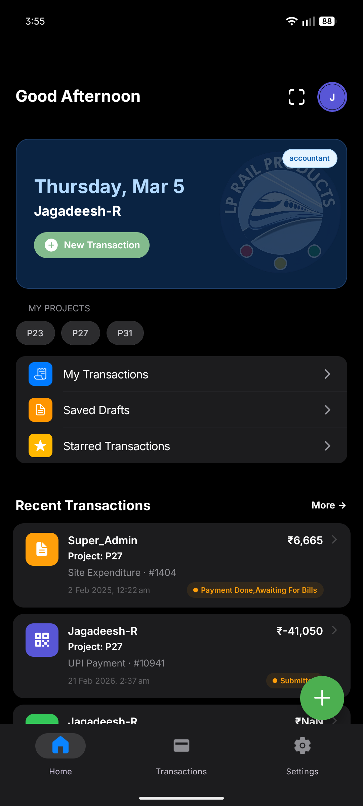

  
  <h1>PayBill: The Engineering Story</h1>
  
<em>A deep dive into the architecture of a modern, seamless financial application.</em>

  
  

    <strong>Author & Lead Developer:</strong> Jagadeesh R  
  

---

## 📖 Introduction: The "What" and the "Why"

In the rapidly evolving landscape of financial technology, the line between a _good_ application and a _great_ one comes down to eliminating **friction**. Mobile payments and enterprise approval workflows are inherently complex—they require multiple parties, strict validation, and impeccable security across unpredictable environments.

**What is PayBill?**  
PayBill is a cross-platform mobile and web application engineered to solve that friction. It handles everything from physical receipt scanning to multi-stage financial approvals in a fluid, unified interface natively for iOS, Android, and Web.

**Why was it built?**  
Existing enterprise solutions often struggle with edge-case networking, clunky forms, or rigid role management. PayBill was architected from the ground up to avoid these pitfalls. We wanted to build a system that fails gracefully offline, strictly separates business logic from the UI layer, and delivers an uncompromising hardware-accelerated experience.

This repository of engineering articles is the story of _how_ we built it.

---

## 📚 Table of Contents

Consider this series as a handbook for building production-ready apps using React Native, Expo, and Supabase.

### [Chapter 1: The Foundation](./paybill-engineering-blog.md)

An overarching look at the problem statement, our domain-driven feature-sliced architecture, and the technology stack (React Native Reanimated, Zustand, Zod) that makes it all tick.

### [Chapter 2: The Vault](./paybill-security-auth-rbac-blog.md)

**Robust Role-Based Access Control and Secure Authentication.**  
Security isn't an afterthought. Learn how we implemented zero-trust API boundaries, encrypted biometric session locks, and rapid multi-user account switching for shared physical devices.

### [Chapter 3: The Engine](./paybill-approval-forms-blog.md)

**Forms Validation Binding and the Approval Engine.**  
Forms are hard. We divorced our UI from our business logic using Zod and React Hook Form, powering a proprietary event-driven state machine tailored for complex financial approval scenarios.

### [Chapter 4: The Bridge](./paybill-qr-scanning-blog.md)

**Seamless QR Code Scanner and Generator.**  
Bridging the physical and digital worlds. Discover the engineering behind our "always-active," hardware-accelerated QR scanner and dynamic bottom-sheet receipt generation.

### [Chapter 5: The Edge](./paybill-offline-sync-blog.md)

**Offline First: Auto Re-Sync and Edge Reliability Architecture.**  
Mobile devices drop connections. See how PayBill limits data loss using local storage drafts and persistent background queues for automatic reconciliation when the network returns.

---

## 💡 Conclusion

Building PayBill was an exercise in constraint and deliberate architectural design. By enforcing rigid boundaries between our data layer and our presentation components, we achieved an application that scales effortlessly as new features are introduced.

Whether you are a fellow engineer dealing with state orchestration, an architect evaluating React Native, or a user curious about how your data is securely handled, I hope these chapters provide a transparent and educational look into the systems that power PayBill.

 

  
<i>"Good architecture makes the complex appear simple."</i>

  
<b>Thank you for reading.</b>

---

> [!NOTE]
> **Data Disclaimer:** All amounts, vendor names, and user specifics shown in the provided screenshots within these chapters are placeholder data generated strictly for conceptual demonstration and development testing purposes.
