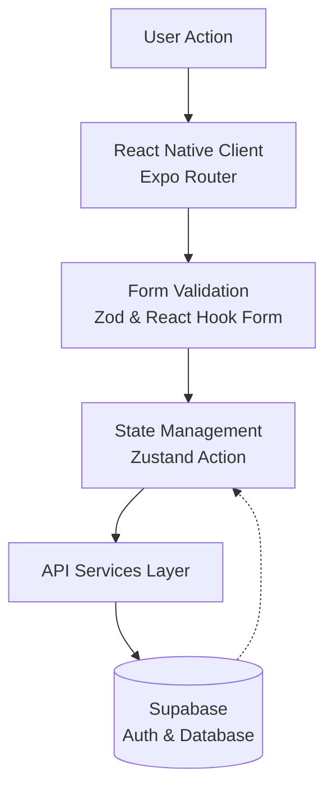
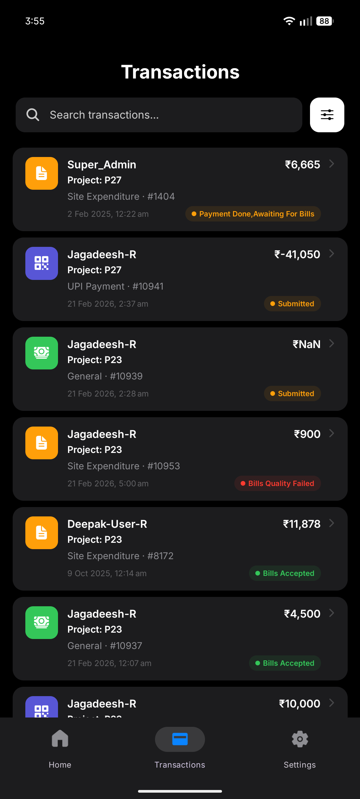
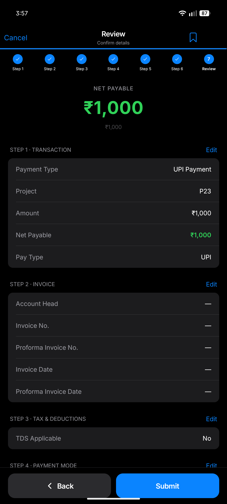

# Building PayBill: A Modern React Native App for Seamless Transactions

In the rapidly evolving financial technology space, managing bills and peer-to-peer transactions on mobile devices often means dealing with clunky interfaces, fragmented user experiences, and sluggish performance.

**PayBill** is a modern, cross-platform mobile application engineered to tackle these pain points. Built natively for both iOS and Android—with a fully functional expanding Web version—PayBill delivers a lightning-fast, highly animated, and reliable transaction experience. This post breaks down the architecture, engineering decisions, and technical implementation details behind the project.

> [!NOTE]
> **Screenshot Disclaimer:** All data, names, and transaction details shown in the accompanying screenshots are placeholder data used strictly for testing and conceptual demonstration purposes. They do not represent real users or actual financial records.

---


_The PayBill Home Dashboard showing an overview of recent transactions and active projects._

## The Problem Statement

Existing mobile payment solutions often struggle in three critical areas:

1. **Offline Capabilities**: Handling edge-case network drops elegantly.
2. **Physical Environment Integrations**: Creating responsive, fast, and reliable hardware integrations like QR code scanning.
3. **Developer Maintainability**: As mobile applications scale in complexity—incorporating web-based onboarding, global transient state, and extensive dynamic form validation—the frontend architecture typically degrades. This often results in a tangled web of prop drilling, tight coupling between UI and business logic, and fragile state management.

PayBill was architected specifically to solve these issues. It offers streamlined mobile payments, physical bill scanning, and robust transaction tracking while maintaining an uncompromisingly smooth UI built on a highly modular React Native architecture.

---

## System Overview

At a high level, PayBill follows a modular, feature-first architecture on the client side, communicating asynchronously with a highly scalable cloud backend. The system enforces strict separation of concerns: presentation components never make direct API calls, and business logic is completely isolated from the UI presentation layer.

### Architecture Data Flow



This unidirectional data flow creates a predictable application lifecycle:
`User Request → Form (RHF+Zod) → Zustand Action → Service Layer → Supabase → Local State Update`

---


_A fast, filterable transactions list powered by Zustand and Supabase._

## Technology Stack

Every piece of technology in PayBill was chosen to optimize developer velocity without sacrificing production-grade stability or rendering performance.

### Frontend (Mobile & Web)

- **React Native + Expo**: Enables rapid feature development across iOS, Android, and Web with Over-The-Air (OTA) updates and deep native API integrations. With Expo's Web support, PayBill extends its reach to desktop users using the exact same React components.
- **Expo Router**: Utilizes file-system-based routing to effortlessly handle native stack navigation, deep linking, and web-specific URLs without complex, imperative navigation controllers.
- **Zustand**: Chosen over Redux for its lightweight, unopinionated approach to global state management. It is specifically utilized for handling ephemeral states, like global transaction filters.
- **React Native Reanimated (v3)**: Operates directly on the native UI thread to deliver hardware-accelerated, 60fps micro-interactions without being blocked by JavaScript bridge traffic.

### Data & Backend Integrations

- **Supabase**: An open-source Firebase alternative powering our secure authentication flows, row-level security (RLS), and database interactions.
- **React Hook Form & Zod**: Provides type-safe form validation. Zod schemas guarantee runtime data integrity before the payload ever touches our service layer.

---


_Secure biometric unlock screen preventing unauthorized access._

## Domain-Driven Project Structure

Instead of a flat, purely technical grouping (e.g., grouping all components together, all hooks together), we elected for a **feature-sliced architecture**. This ensures domain logic remains isolated and the app scales predictably.

```text
paybill-root
├── app/               # Expo Router file-based pages and API routes
├── components/        # Shared, purely presentational UI components
├── features/          # Domain-specific logic (e.g., qr-scanner, onboarding)
├── services/          # API/Backend integration layer (auth, transactions)
├── store/             # Global Zustand state stores
├── schemas/           # Zod validation schemas
└── utils/             # Helper formats and constants
```

This structure is highly intentional. For example, our Web Onboarding components live entirely within `features/onboarding` and do not pollute the heavily reused `components/` directory. This guarantees that new, isolated experimental features cannot unintentionally break core transaction flows.

---

## Engineering Decisions & Key Features

### Animated FAB & Bottom Sheet Synchronization

To create a premium feel, we utilized `React Native Reanimated 3` to build a custom Floating Action Button (FAB). The FAB features an interruptible state transition—dynamically rotating an interactive `+` into an `x`.

We synchronized the FAB's animation values directly with a Gorhom Bottom Sheet overlay. This ensures a fluid, 60fps experience even on low-end Android devices, successfully mitigating complex keyboard avoidance issues when creating a new transaction.

### Always-Active QR Logic

QR code scanning is frequently a bottleneck in mobile payments. We extracted the QR Code scanner into an isolated feature module that operates continuously without requiring manual re-triggering. Upon a successful scan, it instantly executes internal deep links via Expo Router. To elevate the experience, we layered this with custom UI overlay components, including precision corner markers and a continuous laser sweep animation.

### Resilient Transaction Drafts & Overlay Share Sheets

To handle offline-first and user-interrupted flows gracefully, we implemented resilient **Transaction Drafts**. Users can begin a payment and save it as a draft (which stores amount and timestamp metadata locally) to resume later.

Upon completing a transaction, we generate localized `BottomSheetModal` components acting as dynamic, shareable receipts. These interface layers incorporate QR codes and copy-to-clipboard functionality. By rendering directly in the transaction detail route, we circumvented top-level Z-index navigation conflicts often found in complex React Native apps.

---


_A multi-step transaction review screen seamlessly handling complex form inputs._

## Overcoming Architectural Challenges

1. **Filter State Decoupling**: Initially, transaction filtering logic was tightly coupled to our historical views. As feature requirements grew, this scaled poorly. We refactored the filters into a dedicated modal screen (`app/filter-modal.tsx`), elevating the state into a global Zustand store (`store/filterStore.ts`). Now, any screen in the application can read and mutate active filters cleanly without heavy prop-drilling.
2. **Keyboard Avoidance in Modal Overlays**: A classic mobile engineering hurdle. By strictly typing our input dependencies and overriding default Gorhom BottomSheet configurations, we ensured our transaction forms remain perfectly accessible even when the native soft keyboard attempts to push the screen viewport out of bounds.

---

## Future Roadmap

Our engineering roadmap includes several key upgrades focusing on localized edge reliability and scale:

- **Offline Sync Engine**: Building a localized SQLite cache layer for seamless edge-case network drop handling, utilizing a background sync queue when connections are restored.
- **Multi-user Support**: Implementing complex transaction splitting configurations and joint-group management.
- **Observability**: Adding comprehensive logging and telemetry to proactively monitor component render metrics and interactively trace dropped frames in production.

---

## Conclusion

PayBill represents a polished, modern approach to mobile transaction applications. By prioritizing extreme architectural decoupling, leveraging powerful state management patterns, and strictly enforcing UI thread animations, the project serves as a robust benchmark for building production-grade React Native architectures.
