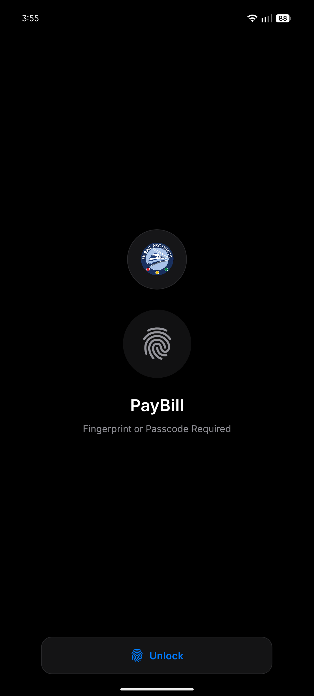

<div align="center">
  <p><i>PayBill Engineering Series &middot; Chapter 2</i></p>
  <a href="./README.md">← Back to Table of Contents</a>
</div>

---

# The Vault: Robust Role-Based Access Control and Secure Authentication

In financial and enterprise applications, security isn't just a feature—it's the foundational layer of the entire product. At PayBill, we manage sensitive financial transactions, requiring a security architecture that is both impenetrable and totally transparent to authorized users.

This post explains how we implemented Secure Authentication, Multi-user Login, and Role-Based Access Control (RBAC) in a modern React Native application.

---

## 1. The Challenge

Enterprise payment workflows require multiple eyes on a single transaction. A field agent might generate an expense request, but a department manager must review it, and a financial admin must execute the bank transfer.

We needed a system that could dynamically render UI components and enforce strict API boundaries based on five distinct user roles: `user`, `admin`, `financialadmin`, `accountant`, and `superadmin`.

Our requirements:

- **Zero-trust boundary:** The client cannot be trusted; the backend must enforce all role rules.
- **Client-side responsiveness:** The UI needs to adapt instantly without waiting for network calls.
- **Multi-user Support & Fast Switching:** Support secure switching between accounts on the same physical device without leaking session data.
- **Biometric Locking:** Physical device security layers enforced at the application level.

---

## 2. Secure Authentication & Session Management

We built our authentication layer on top of **Supabase** (PostgreSQL + GoTrue auth).

### Token Lifecycle

When a user logs in, they receive a JWT. Instead of storing this directly in insecure `AsyncStorage`, we utilize secure, encrypted storage mechanisms leveraging native iOS Keychain and Android Keystore APIs.

### The Biometric App Lock

Before the application even mounts the React tree, we intercept the startup sequence with an `AppLock` screen. This requires Passcode or Biometric confirmation (FaceID/TouchID). It ensures that even if a device is handed to someone else while unlocked, the financial data inside PayBill remains protected.



### Secure Account Switching

To support shared devices (e.g., a shared tablet at a construction site office), we implemented a Multi-user Login flow. The local state management retains secure context pointers to different encrypted session tokens. Swapping accounts requires biometric re-authentication but fundamentally avoids the heavy cost of a full cold-start login network request.


---

## 3. Role-Based Access Control (RBAC)

Our RBAC implementation utilizes a dual-layer approach: **Optimistic UI filtering** and **Strict Server-Side enforcement**.

### Defining the Hierarchy

Inside our types definitions (e.g., `features/transaction-engine/types.ts`), we strictly define our roles:

```typescript
export const USER_ROLES = [
  "user",
  "admin",
  "financialadmin",
  "accountant",
  "superadmin",
] as const;
export type UserRole = (typeof USER_ROLES)[number];
```

### The Client Layer

Every React component that handles a privileged action (like an "Approve" button) consumes a global Zustand `authStore`. Before rendering, a helper hook evaluates the current user role against the required action. If the role check fails, the component isn't just disabled—it's omitted from the render tree entirely.

### The Backend Layer

UI hiding is not security. Our backend APIs enforce strict JWT payload checking. If an `admin` tries to execute an endpoint reserved for an `accountant` (like finalizing a bank upload), the API rejects the payload with a `404/400 Invalid Role` or `401 Unauthorized` before the database transaction ever begins.

---

## 4. Why This Architecture Wins

1. **Scalability:** Adding a new role requires adding a single string to our types and updating the centralized backend middleware. No hunting through thousands of lines of React code.
2. **Speed:** By using encrypted local storage and Zustand, our UI feels instantly responsive when determining permission levels.
3. **Enterprise Readiness:** The combination of native biometric locking, encrypted keychain storage, and strict RBAC puts PayBill on par with top-tier banking applications.

Security in PayBill is never an afterthought; it is built strictly into the DNA of the application architecture.

---

<div align="center">
  <a href="./paybill-approval-forms-blog.md">Next Chapter: The Engine (Forms & Approvals) →</a>
  <br /><br />
  <a href="./README.md">← Return to Table of Contents</a>
</div>
